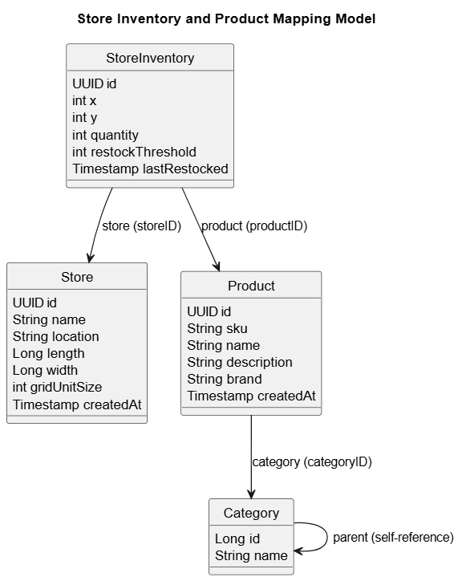

# Guiderr Backend API

A Spring Boot + PostgreSQL REST API for managing stores, products, and inventory across multiple locations. This backend powers the Guiderr platform, providing endpoints for store creation, product inventory management, and advanced filtering for grid based representation and shortest part finding for customer satisfaction


---
## Technologies Used

- **Java 17**
- **Spring Boot**
- **PostgreSQL**
- **Maven**
- **Swagger (OpenAPI 3)**
- **Jakarta Validation**

---

## UML Model


---


## 🛠️ Getting Started

### 📦 Prerequisites

- Java 17+
- Maven
- PostgreSQL 

---

### 🧱 Database Setup

Create the database and user:
```

Update your `application.properties`:

```properties
spring.datasource.url=jdbc:postgresql://localhost:5432/walmartDB
spring.datasource.username=postgres
spring.datasource.password=root
```

---

### ▶️ Running the App

#### With Maven

```bash
mvn spring-boot:run
```

#### Or Build and Run the JAR

```bash
mvn clean package
java -jar target/guiderr-1.0.0.jar
```

---

## 📚 API Documentation

Once the app is running, access the Swagger UI:

```
http://localhost:8080/swagger-ui.html
```

---

## 🔗 API Endpoints

### 📁 Category Endpoints

| Method | Endpoint           | Description               |
| ------ | ------------------ | ------------------------- |
| POST   | `/category`        | Create a new category     |
| POST   | `/category/id`     | Get category by ID        |
| PUT    | `/category`        | Update category details   |
| DELETE | `/category`        | Delete category by ID     |
| GET    | `/categories`      | Get all categories        |
| POST   | `/categories/name` | Search categories by name |


### 🏬 Store Endpoints
| Method | Endpoint      | Description           |
| ------ | ------------- | --------------------- |
| POST   | `/store`      | Create a new store    |
| POST   | `/store/id`   | Get store by ID       |
| POST   | `/store/name` | Search stores by name |
| PUT    | `/store`      | Update store details  |
| DELETE | `/store`      | Delete store by ID    |
| GET    | `/store/all`  | Get all stores        |


### 📦 Product Endpoints
| Method | Endpoint         | Description                    |
| ------ | ---------------- | ------------------------------ |
| POST   | `/product`       | Create a new product           |
| DELETE | `/product`       | Delete product by ID           |
| GET    | `/product`       | Get all products               |
| POST   | `/product/id`    | Get product by ID              |
| POST   | `/product/sku`   | Get product by SKU             |
| POST   | `/product/name`  | Search products by name        |
| POST   | `/product/brand` | Search products by brand       |
| POST   | `/product/price` | Filter products by price range |


### 🧮 Store Inventory Endpoints
| Method | Endpoint                             | Description                                     |
| ------ | ------------------------------------ | ----------------------------------------------- |
| POST   | `/store-inventory`                   | Add product to a store                          |
| DELETE | `/store-inventory`                   | Remove product from a store                     |
| PUT    | `/store-inventory/quantity`          | Update product quantity in a store              |
| PUT    | `/store-inventory/restock-threshold` | Update restock threshold for a product in store |
| POST   | `/store-inventory/products`          | Get all products in a given store               |
| POST   | `/store-inventory/stores`            | Get all stores that stock a given product       |


### 🔍 Inventory Filters
| Method | Endpoint                        | Description                               |
| ------ | ------------------------------- | ----------------------------------------- |
| POST   | `/store-inventory/filter/id`    | Get inventory by storeId and productId    |
| POST   | `/store-inventory/filter/name`  | Filter products in a store by name        |
| POST   | `/store-inventory/filter/sku`   | Filter products in a store by SKU         |
| POST   | `/store-inventory/filter/brand` | Filter products in a store by brand       |
| POST   | `/store-inventory/filter/price` | Filter products in a store by price range |

---

## Endpoints JSON

# 📥 How to Import the Postman Collection

You can test all API endpoints using the provided Postman collection.
- Open Postman.
- Click on "Import" in the top-left corner.
- Select the "Link" tab.
- Paste the following URL:


[Postman Collection Link](https://.postman.co/workspace/My-Workspace~01d841cf-b95c-4d05-88da-04b153cf5ce2/collection/32157070-e53c1213-108a-4132-a078-983ef9c556f0?action=share&creator=32157070)


## 🧰 Development Notes

- Uses `ApiResponse<T>` wrapper for all responses
- DTOs are validated using `@Valid` and Jakarta Bean Validation
- Swagger annotations can be added for enhanced API docs

---

## .gitignore Highlights

- Ignores `target/`, `.classpath`, `.settings/`, `.idea/`, `.log`, and OS junk
- Keeps Maven wrapper files for CI/CD compatibility

---

## License

MIT 

---

## Author

Aryaman Gudwani
```