# Guiderr Backend API

A Spring Boot + PostgreSQL REST API for managing stores, products, and inventory across multiple locations. This backend powers the Guiderr platform, providing endpoints for store creation, product inventory management, and advanced filtering for grid based representation and shortest part finding for customer satisfaction


---
## Technologies Used

- **Java 17**
- **Spring Boot**
- **PostgreSQL**
- **Maven**
- **Swagger (OpenAPI 3)**
- **Jakarta Validation**

---

## UML Model


---


## 🛠️ Getting Started

### 📦 Prerequisites

- Java 17+
- Maven
- PostgreSQL 

---

### 🧱 Database Setup

Create the database and user:
```

Update your `application.properties`:

```properties
spring.datasource.url=jdbc:postgresql://localhost:5432/walmartDB
spring.datasource.username=postgres
spring.datasource.password=root
```

---

### ▶️ Running the App

#### With Maven

```bash
mvn spring-boot:run
```

#### Or Build and Run the JAR

```bash
mvn clean package
java -jar target/guiderr-1.0.0.jar
```

---

## 📚 API Documentation

Once the app is running, access the Swagger UI:

```
http://localhost:8080/swagger-ui.html
```

---

## 🔗 API Endpoints

### 🏬 Store Controller

| Method | Endpoint              | Description                     |
|--------|-----------------------|---------------------------------|
| PUT    | `/api/store`          | Update a store                  |
| POST   | `/api/store`          | Create a new store              |
| DELETE | `/api/store`          | Delete a store                  |
| POST   | `/api/store/name`     | Get store by name               |
| POST   | `/api/store/id`       | Get store by ID                 |
| GET    | `/api/store/all`      | Get all stores                  |

---

### 📦 Store Inventory Controller

| Method | Endpoint                                      | Description                          |
|--------|-----------------------------------------------|--------------------------------------|
| POST   | `/api/store-inventory`                        | Add product to store                 |
| DELETE | `/api/store-inventory`                        | Remove product from store            |
| PUT    | `/api/store-inventory/quantity`               | Update product quantity              |
| PUT    | `/api/store-inventory/restock-threshold`      | Update restock threshold             |
| POST   | `/api/store-inventory/products`               | Get products in a store              |
| POST   | `/api/store-inventory/stores`                 | Get stores having a product          |
| POST   | `/api/store-inventory/filter/id`              | Filter product by ID in store        |
| POST   | `/api/store-inventory/filter/sku`             | Filter product by SKU in store       |
| POST   | `/api/store-inventory/filter/name`            | Filter products by name in store     |
| POST   | `/api/store-inventory/filter/brand`           | Filter products by brand in store    |
| POST   | `/api/store-inventory/filter/price`           | Filter products by price range       |

---

### 📦 Product Controller Endpoints

| Method | Endpoint             | Description                        |
|--------|----------------------|------------------------------------|
| POST   | `/api/product`       | Get product by ID                  |
| PUT    | `/api/product`       | Update product                     |
| POST   | `/api/product`       | Create a new product               |
| DELETE | `/api/product`       | Delete product                     |
| GET    | `/api/products`      | Get all products                   |
| POST   | `/api/product/sku`   | Get product by SKU                 |
| POST   | `/api/product/price` | Get products by price range        |
| POST   | `/api/product/name`  | Get products by name               |
| POST   | `/api/product/brand` | Get products by brand              |

---

### 🏷️ Category Controller Endpoints

| Method | Endpoint                  | Description                        |
|--------|---------------------------|------------------------------------|
| POST   | `/api/category`           | Get category by ID                 |
| PUT    | `/api/category`           | Update category                    |
| POST   | `/api/category`           | Create a new category              |
| DELETE | `/api/category`           | Delete category                    |
| GET    | `/api/categories`         | Get all categories                 |
| POST   | `/api/categories/name`    | Get categories by name             |

---

---

## 🧪 Sample Requests & Responses
## Store-Controller

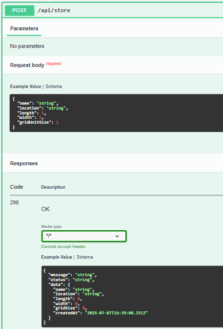
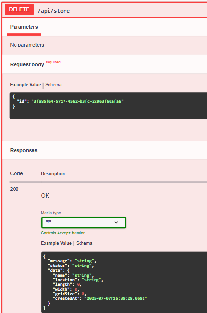
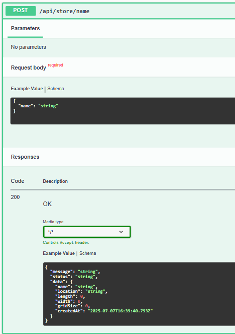
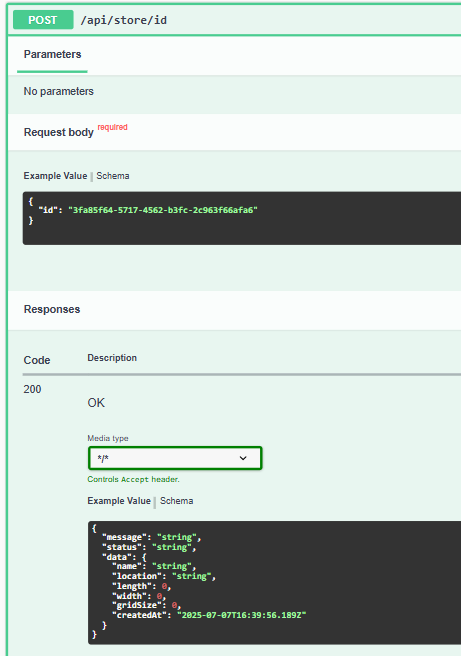
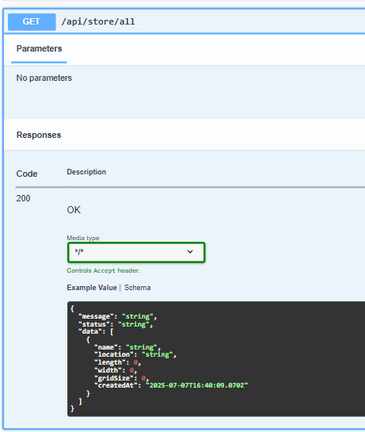

## Store-Inventory-Controller
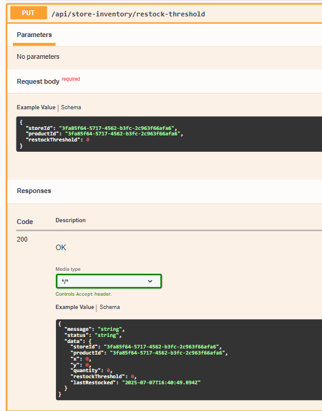
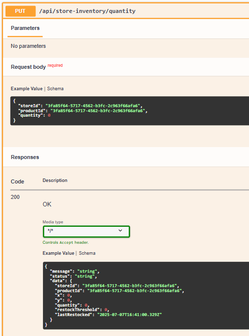
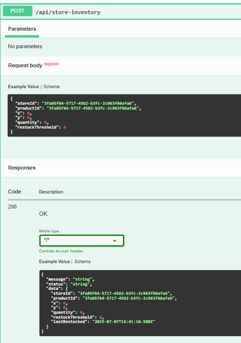
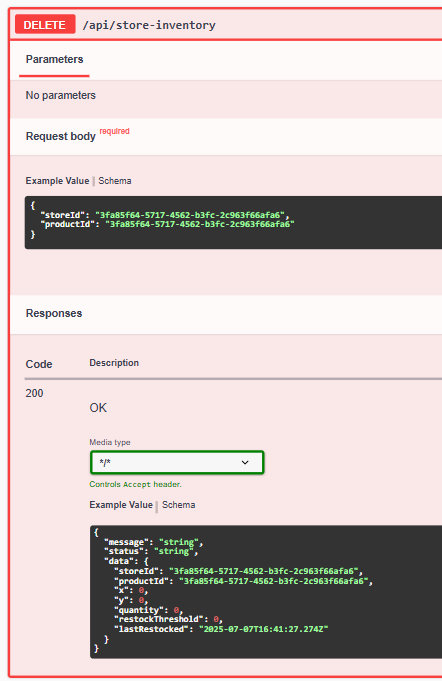
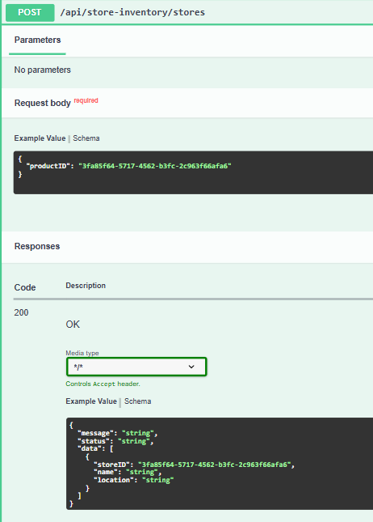
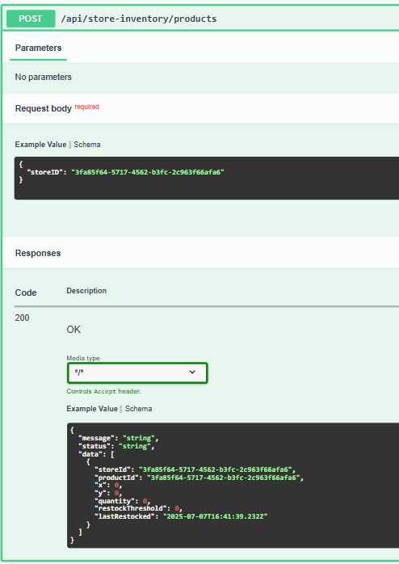
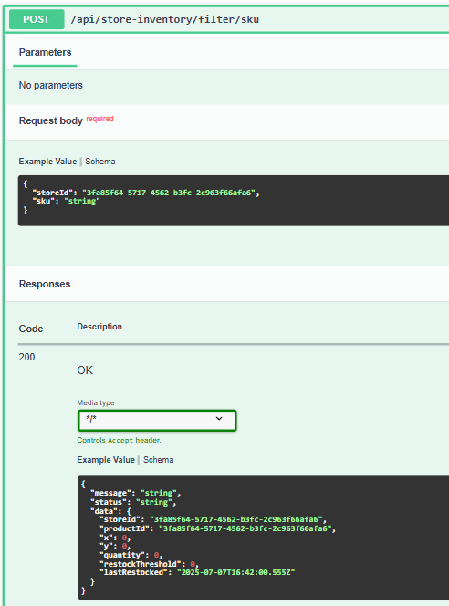
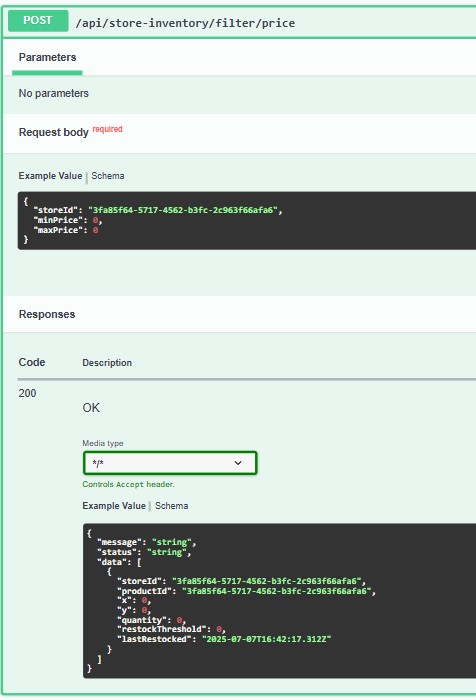
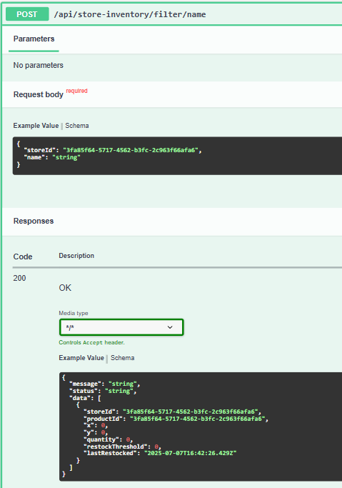

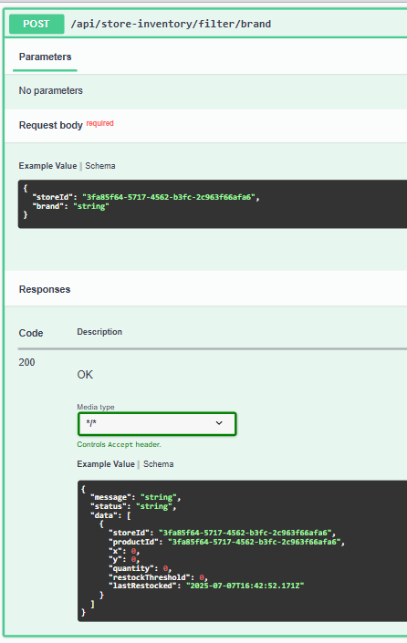

## Product-Controller

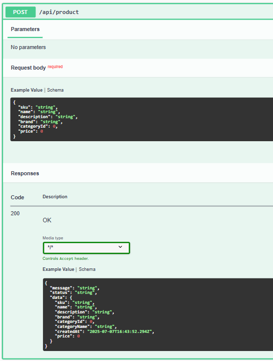
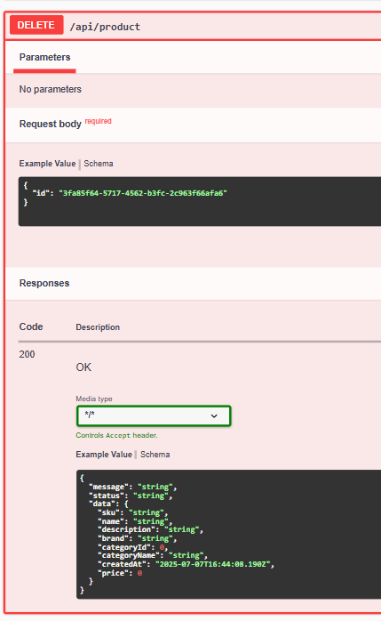
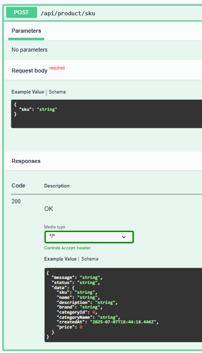
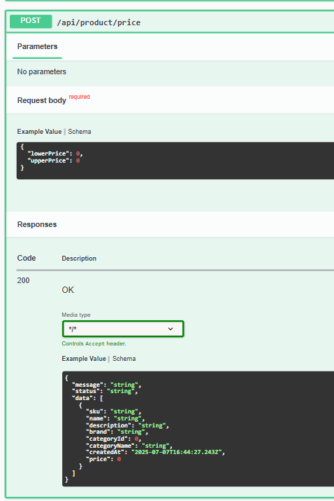
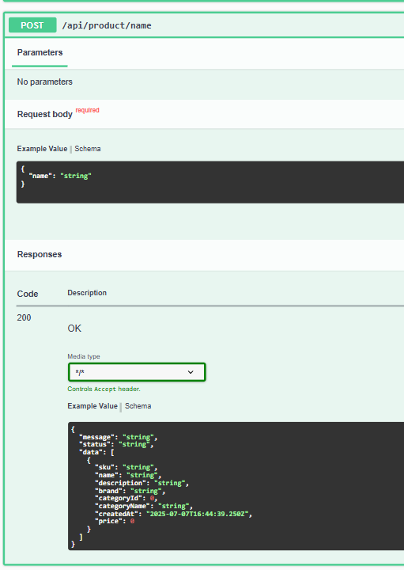
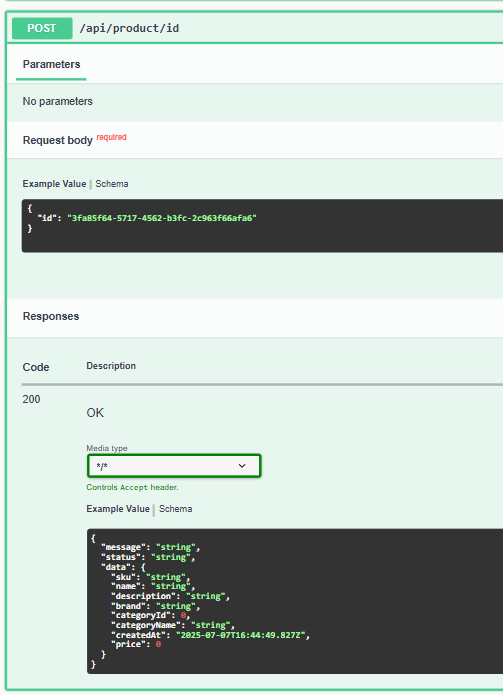
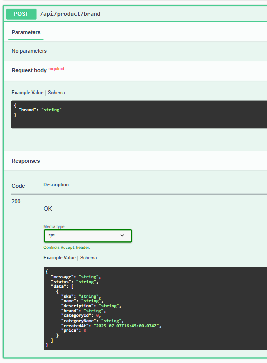
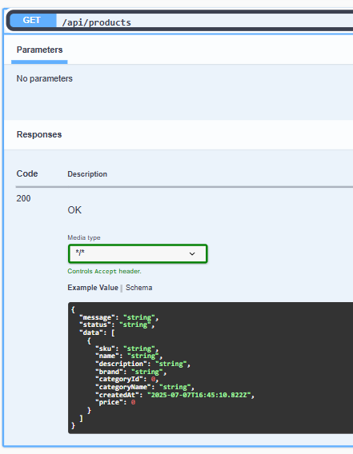

## Category-Controller
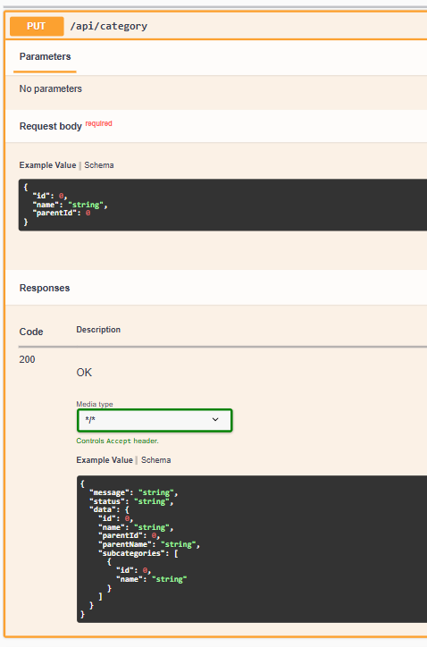
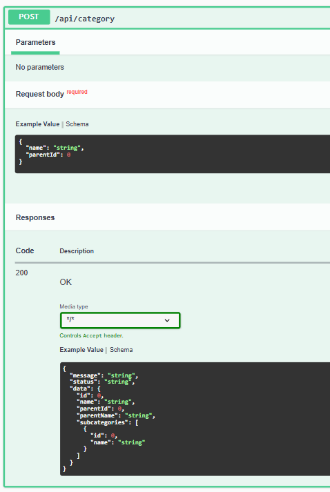
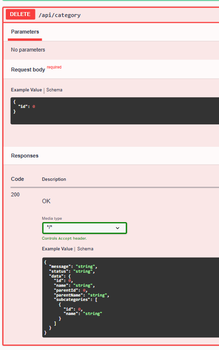
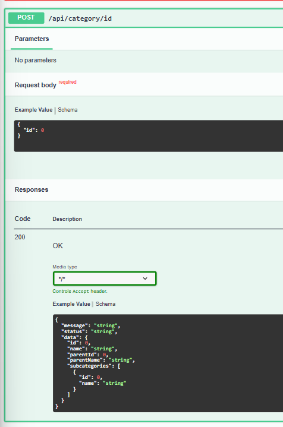
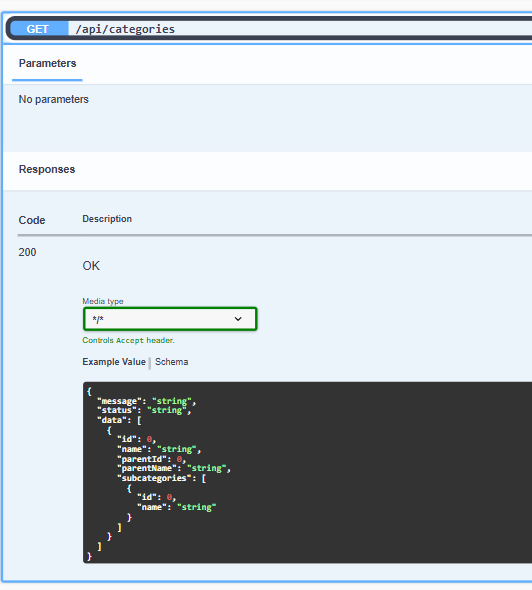
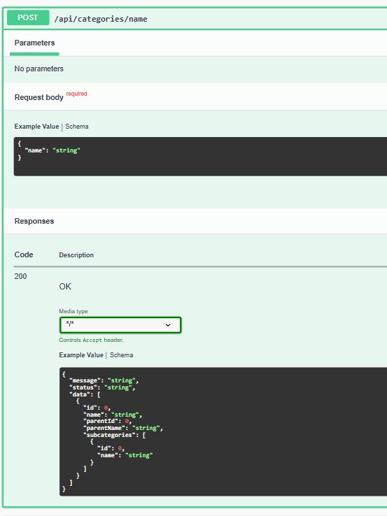

---

## 🧰 Development Notes

- Uses `ApiResponse<T>` wrapper for all responses
- DTOs are validated using `@Valid` and Jakarta Bean Validation
- Swagger annotations can be added for enhanced API docs

---

## .gitignore Highlights

- Ignores `target/`, `.classpath`, `.settings/`, `.idea/`, `.log`, and OS junk
- Keeps Maven wrapper files for CI/CD compatibility

---

## License

MIT 

---

## Author

Aryaman Gudwani
```